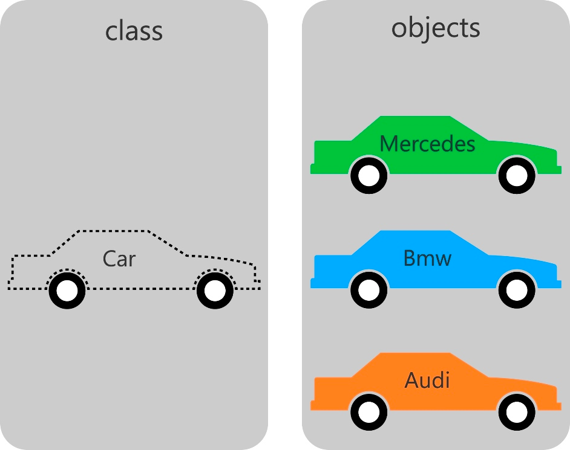

# Programmation orientée objet

## Introduction

La programmation orientée objet est un paradigme de programmation qui permet de modéliser des objets du monde réel. En programmation orientée objet, on définit des classes qui représentent des objets du monde réel. On peut ensuite créer des instances de ces classes, qui sont des objets du monde réel. Par exemple, on peut définir une classe `Voiture` qui représente une voiture. On peut ensuite créer des instances de cette classe, par exemple une voiture rouge, une voiture bleue, etc.

La programmation orientée objet permet de créer des programmes plus complexes et plus modulaires. Elle permet aussi de réutiliser du code plus facilement.

Elle repose sur quatre concepts fondamentaux :

* L'encapsulation : les données et les méthodes qui les manipulent sont regroupées dans une même classe.
* L'héritage : on peut définir une classe qui hérite des propriétés d'une autre classe.
* Le polymorphisme : on peut définir plusieurs classes qui héritent d'une même classe, et qui ont chacune des méthodes avec le même nom. On peut alors appeler ces méthodes sur des instances de ces classes différentes, et le programme saura appeler la bonne méthode.
* L'abstraction : on peut définir des classes abstraites qui ne peuvent pas être instanciées, mais qui servent de base à d'autres classes.

## Classes et instances

La classe est le modèle qui sera utilisé pour créer des objets. Une classe est une sorte de "plan" qui décrit les propriétés et les méthodes d'un objet. 

Les instances sont des objets créés à partir d'une classe. Une instance est une copie d'une classe. Une classe peut avoir plusieurs instances.

## Exemple

Ci joint un exemple d'une classe voiture et de ses instances.

Le main se charge d'instancier 3 voitures différentes et de les afficher.
