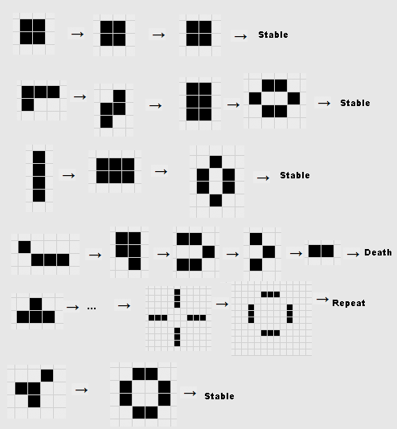

# Jeu de la vie (Game Of Life) de Conway

Le jeu de la vie est un automate cellulaire imaginé par John Horton Conway en 1970. Il est composé d'une grille de cellules carrées, qui peuvent être soit vivantes, soit mortes. À chaque étape, l'état de chaque cellule est déterminé en fonction de l'état de ses voisines. Le jeu est terminé lorsque plus aucune cellule ne change d'état.

## Règles

Le jeu de la vie est un automate cellulaire à deux dimensions composé d'une grille de cellules carrées, qui peuvent être soit vivantes, soit mortes. À chaque étape, l'état de chaque cellule est déterminé en fonction de l'état de ses huit voisines (les cellules qui sont directement à gauche, à droite, en haut, en bas, ou sur les diagonales). Les règles sont les suivantes :

1. Une cellule morte possédant exactement trois voisines vivantes devient vivante.
2. Une cellule vivante possédant deux ou trois voisines vivantes reste vivante, sinon elle meurt.
3. Toutes les autres cellules meurent ou restent mortes.
4. Les bords de la grille sont considérés comme morts.
5. Les cellules hors de la grille sont considérées comme mortes.

## Exemple

Voici des exemples de configurations initiales et de leurs états suivants.

## Votre mission

Vous devez compléter la fonction de calcul de l'état suivant du jeu de la vie. Elle prend en paramètre une grille de cellules ainsi que les dimensions de la grille de jeu et retourne une nouvelle grille de cellules.

Vous devez utiliser la classe Cell pour représenter les cellules. 

Vous êtes libre de créer d'autres classes si vous le souhaitez. Ceci afin d'ajouter des arguments ou des méthodes à la classe Cell.

## Tests

La méthode main se charge de lancer une application graphique pour tester votre algorithme.

Vous pouvez ensuite cliquer sur les cellules afin de rendre vivantes certaines cellules, puis utilisez le menu pour lancer la simulation et voir comment se comporte votre algorithme.

## Ressources

- [https://fr.wikipedia.org/wiki/Jeu_de_la_vie](https://fr.wikipedia.org/wiki/Jeu_de_la_vie)
