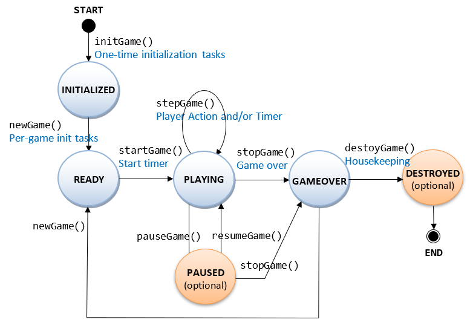
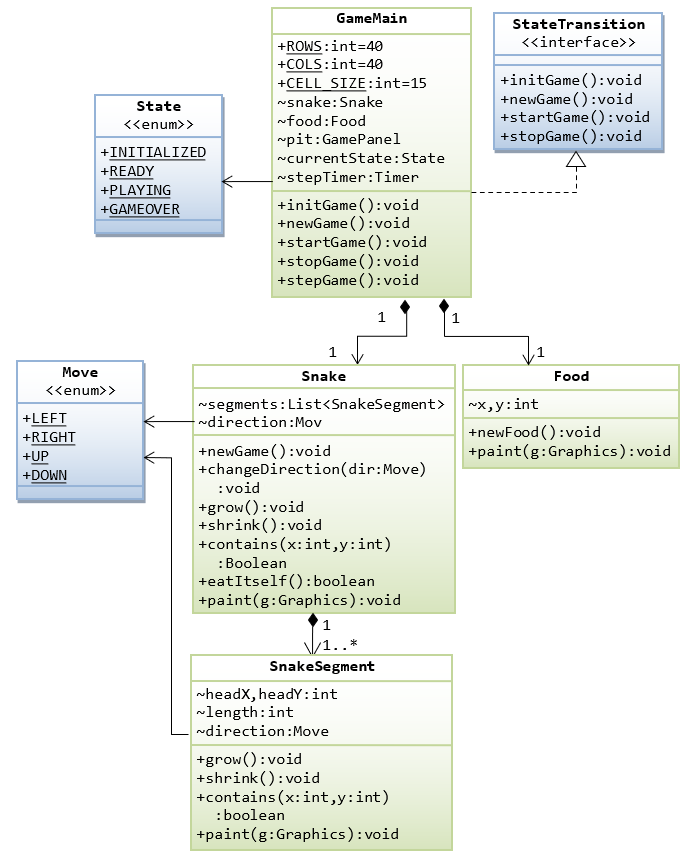
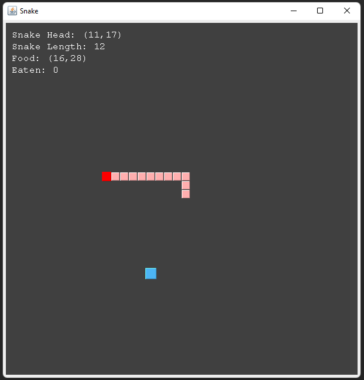

# Enoncé

Le but de cette séquence est d'implémenter le jeu du SNAKE.


Règles du jeu :
- Le serpent commence au centre du labyrinthe, regarde vers le haut et se déplace à une vitesse constante.
- Il y a toujours un aliment dans le labyrinthe. L'aliment apparaît à un endroit aléatoire et persiste pendant une période aléatoire.
- Le serpent grandit d'une cellule après avoir mangé un aliment.
- Le serpent meurt soit en touchant le bord du labyrinthe, soit en touchant sa propre queue.
- Le score final est basé sur le nombre d'aliments mangés.
- Le serpent peut se déplacer dans les quatre directions (haut, bas, gauche, droite). Il ne peut pas se déplacer dans la direction opposée à sa direction actuelle.

## Game state diagram

Le diagramme ci-dessous représente l'état du jeu à un instant donné.



La plupart des jeux suivent un schéma similaire. Nous allons implémenter ce schéma dans notre jeu.

Une interface StateTransition proposera les méthodes suivantes :
- initGame() : réalise les tâches d'initialisation une seule fois, comme la construction d'objets, l'ouverture de fichiers, la configuration des timers et des gestionnaires d'événements clavier/souris.
- newGame() : réalise les tâches d'initialisation par partie, comme la réinitialisation du score, le nettoyage de la grille de jeu, etc.
- startGame() : démarre tous les timers.
- stopGame() : arrête les timers, met à jour les statistiques de jeu telles que le meilleur score.
- destroyGame() : tâches de ménage avant la sortie du programme.
- stepGame() : 2 types de déclencheurs : action de l'utilisateur tel que la touche de clavier ou le bouton-poussoir et/ou le timer.
- pauseGame()/resumeGame() : suspend/reprend les timers.

#### Notes

Pour réaliser un dessin personnalisé, utilisez un JPanel et surchargez sa méthode paintComponent(Graphics), qui est appelée via repaint().
Tous les TextField/Lable doivent mettre à jour immédiatement leur affichage, chaque fois que leur valeur change, via component.setText().

## Class diagram



Un serpent est constitué d'un ou plusieurs segments horizontaux ou verticaux. Un labyrinthe contient un serpent et un aliment. Une énumération Direction est définie comme une classe imbriquée statique de Snake pour les quatre directions de déplacement : UP, DOWN, LEFT et RIGHT.

## Rendu final



## Implémentation

En Kotlin, nous allons utiliser les classes suivantes :
- `State` : énumération contenant les différents états du jeu. Les états sont représentés dans le Game State Diagram.
- `StateTransition` : interface contenant les méthodes pour gérer les différents états du jeu.
- `Move` : énumération contenant les différents mouvements possibles du serpent.
- `Food` : classe représentant un aliment.
- `Snake` : classe représentant le serpent.
- `SnakeSegment` : classe représentant un segment du serpent.

Le code de GameMain et GamePanel sont déjà implémentés. Vous devez respecter leurs appels aux méthodes de StateTransition.

<div class="hint">
Vous devrez utiliser des méthodes pour dessiner dans le contexte graphique. 

Vous utiliserez essentiellement la méthode fill3DRect() de la classe Graphics pour dessiner des rectangles et les remplir d'une couleur.

Exemple de code pour dessiner la tête du serpent (en rouge) :
```kotlin
fun paint(g: Graphics) {
    g.color = COLOR_HEAD
    g.fill3DRect(
        headX * CELL_SIZE - offset / 2, headY * CELL_SIZE - offset / 2,
        CELL_SIZE - 1 + offset, CELL_SIZE - 1 + offset, true
    )
}
```


</div>


