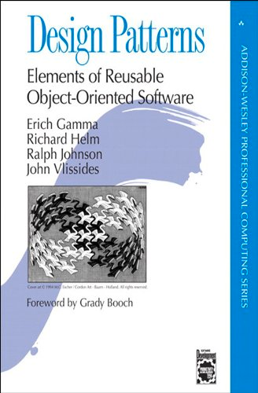
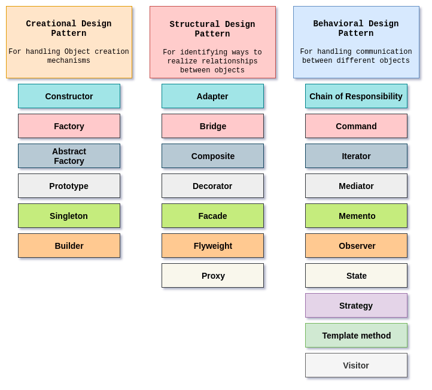

# Design patterns (patrons de conception)

## Introduction

Les design patterns sont des solutions réutilisables à des problèmes récurrents de conception. Ils sont décrits dans des livres, des articles, des blogs, des présentations, etc. Ils sont souvent décrits avec des diagrammes UML, mais il est important de comprendre que les diagrammes UML ne sont pas des design patterns. Les diagrammes UML sont des outils de conception, et les design patterns sont des solutions à des problèmes de conception.

## Historique

Les design patterns ont été introduits par Christopher Alexander dans son livre "A Pattern Language: Towns, Buildings, Construction" en 1977. Il a été suivi par le livre "Design Patterns: Elements of Reusable Object-Oriented Software" de Erich Gamma, Richard Helm, Ralph Johnson et John Vlissides en 1994. Le livre de Gamma et al. est devenu un best-seller et a été traduit en plusieurs langues. Il a été suivi par plusieurs autres livres sur les design patterns.

## Types de design patterns

Les design patterns peuvent être classés en trois catégories:

* Création
* Structure
* Comportement

Nous allons lister quelques exemples de design patterns dans chaque catégorie. Sachez qu'il existe des dizaines de design patterns dans chaque catégorie, et que vous pouvez trouver une liste complète sur le site [Refactoring Guru](https://refactoring.guru/design-patterns).

Nous nous concentrerons dans les chapitres suivants sur certains designs patterns afin de comprendre plus en détail leur fonctionnement et leur implémentation.

## Création

Les design patterns de création sont utilisés pour créer des objets. Ils sont souvent utilisés dans les classes de fabrique, les méthodes de fabrique et les classes abstraites.

### Fabrique

La fabrique est un patron de conception de création qui utilise une méthode de fabrique pour résoudre le problème de création d'objets sans avoir à spécifier la classe concrète de l'objet que vous souhaitez créer.

### Fabrique abstraite

La fabrique abstraite est un patron de conception de création qui fournit une interface pour créer des familles de produits liés sans spécifier leurs classes concrètes.

### Constructeur

Le constructeur est un patron de conception de création qui permet de créer des objets complexes étape par étape. Le constructeur permet de produire des objets différents en utilisant le même code de construction.

### Prototype

Le prototype est un patron de conception de création qui permet de copier des objets existants sans faire appel au constructeur.

### Singleton

Le singleton est un patron de conception de création qui permet de s'assurer qu'une classe n'a qu'une seule instance et fournit un point d'accès global à cette instance.

## Structure

Les design patterns de structure sont utilisés pour simplifier l'architecture d'un logiciel. Ils sont souvent utilisés dans les classes de base et les classes dérivées.

### Adaptateur

L'adaptateur est un patron de conception de structure qui permet à deux objets incompatibles de collaborer.

### Pont

Le pont est un patron de conception de structure qui sépare une abstraction de son implémentation afin qu'ils puissent être modifiés indépendamment.

### Composite

Le composite est un patron de conception de structure qui permet de traiter des objets individuels et des compositions d'objets de manière uniforme.

### Décorateur

Le décorateur est un patron de conception de structure qui permet de dynamiquement ajouter un nouveau comportement à un objet existant sans modifier sa structure.

### Facade

La façade est un patron de conception de structure qui fournit une interface simplifiée à une bibliothèque, un framework ou un ensemble de classes.

### Flyweight

Le flyweight est un patron de conception de structure qui permet de partager des objets pour économiser de la mémoire.

### Proxy

Le proxy est un patron de conception de structure qui permet de fournir un objet de remplacement ou un espace réservé pour un autre objet pour contrôler l'accès à celui-ci.

## Comportement

Les design patterns de comportement sont utilisés pour améliorer ou simplifier les algorithmes existants. Ils sont souvent utilisés dans les classes qui implémentent des algorithmes.

### Chaîne de responsabilité

La chaîne de responsabilité est un patron de conception de comportement qui permet à plusieurs objets de traiter une requête en chaînant les objets récepteurs et en transmettant la requête le long de la chaîne jusqu'à ce qu'un objet la traite.

### Commande

La commande est un patron de conception de comportement qui transforme une demande en un objet indépendant qui contient toutes les informations sur cette demande.

### Interpréteur

L'interpréteur est un patron de conception de comportement qui fournit une façon d'évaluer des langages de langage, de formules ou d'instructions.

### Itérateur

L'itérateur est un patron de conception de comportement qui permet de parcourir des éléments d'une collection sans exposer sa représentation sous-jacente.

### Médiateur

Le médiateur est un patron de conception de comportement qui permet de réduire les dépendances complexes entre les objets. Il encourage le faible couplage en empêchant les objets de se référer explicitement les uns aux autres et les encourage à communiquer indirectement via un objet tiers appelé médiateur.

### Mémento

Le memento est un patron de conception de comportement qui permet de capturer et de stocker l'état interne d'un objet sans enfreindre la principale règle d'encapsulation.

### Observateur

L'observateur est un patron de conception de comportement qui permet à un objet de publier des événements à d'autres objets sans en connaître les classes.

### État

L'état est un patron de conception de comportement qui permet à un objet de changer son comportement lorsqu'il change son état interne.

### Stratégie

La stratégie est un patron de conception de comportement qui permet à un objet de changer son comportement en fonction de son état interne.

### Visiteur

Le visiteur est un patron de conception de comportement qui permet d'ajouter de nouvelles opérations ou des modifications de classes existantes sans modifier les classes elles-mêmes.

## Conclusion

Les design patterns sont similaires a des briques de construction. Ils peuvent être utilisés pour créer des applications plus robustes et plus faciles à maintenir. Ils peuvent être utilisés pour résoudre des problèmes récurrents et répétitifs. Ils peuvent être utilisés pour créer des applications plus flexibles et plus évolutives.

Avec l'évolution des langages, certains design patterns sont devenus obsolètes. D'autres sont devenus plus populaires. Cependant, les design patterns sont toujours utilisés dans la plupart des applications.

Parmi les design patterns non utilisés avec Kotlin nous pouvons citer

* Singleton - Kotlin fournit une fonctionnalité de singleton nativement
* Builder - Kotlin fournit une fonctionnalité de construction d'objet nativement
* Prototype - Kotlin fournit une fonctionnalité de prototype nativement
* Iterator - Kotlin fournit une fonctionnalité d'itérateur nativement
* Etc

## Références

* [https://refactoring.guru/design-patterns](https://refactoring.guru/design-patterns)
* [https://www.tutorialspoint.com/design\_pattern/design\_pattern\_introduction.htm](https://www.tutorialspoint.com/design_pattern/design_pattern_introduction.htm)
* [https://www.geeksforgeeks.org/software-design-patterns/](https://www.geeksforgeeks.org/software-design-patterns/)
* [https://www.javatpoint.com/software-design-patterns](https://www.javatpoint.com/software-design-patterns)