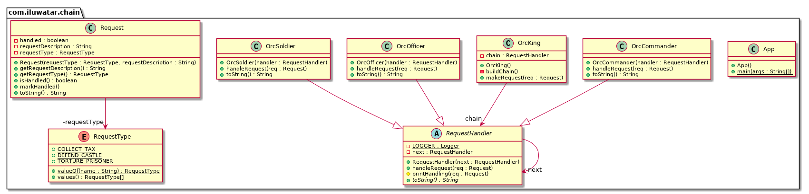

# Cours

## Chaine de responsabilité

La chaine de responsabilité est un patron de conception comportemental qui permet de passer une requête le long d'une chaine de traitement. Chaque traitement de la chaine peut décider de traiter ou non la requête, et de la passer au traitement suivant le cas échéant.

### Utilité

La chaine de responsabilité permet de découpler le code qui envoie une requête du code qui la traite. Cela permet de créer des traitements indépendants les uns des autres, et de les chaîner pour former une chaine de traitement.

### Exemple

Au sein d'un restaurant, le serveur prend la commande du client. Il la transmet ensuite au au chef de cuisine. Le chef de cuisine peut décider de préparer la commande, ou de la transmettre a son commis.

Cette chaine de traitement peut être représentée par la classe suivante :

```kotlin
class Server {
    private var next: Chef? = null

    fun setNext(chef: Chef) {
        next = chef
    }

    fun handleRequest(request: String) {
        next?.handleRequest(request)
    }
}

class Chef {
    private var next: Commis? = null

    fun setNext(commis: Commis) {
        next = commis
    }

    fun handleRequest(request: String) {
        if (request == "Pizza") {
            println("Chef: I'll handle the request.")
        } else {
            next?.handleRequest(request)
        }
    }
}

class Commis {
    fun handleRequest(request: String) {
        println("Commis: I'll handle the request.")
    }
}
```

Le serveur est le premier maillon de la chaine. Il transmet la requête au chef de cuisine. Ce dernier traite la requête uniquement s'il s'agit d'une pizza. Dans le cas contraire, il transmet la requête au commis.

Le main d'utilisation de cette chaine de traitement est le suivant :

```kotlin
fun main() {
    val server = Server()
    val chef = Chef()
    val commis = Commis()

    server.setNext(chef)
    chef.setNext(commis)

    server.handleRequest("Pizza")
    server.handleRequest("Salad")
}
```

Le résultat de l'exécution de ce main est le suivant :

```
Chef: I'll handle the request.

Commis: I'll handle the request.
```

# Exercice

Nous allons mettre en pratique ce patron de conception en créant une chaine de traitement d'ordres au sein d'une cité Orque.

Le roi Orc donne des ordres à son armée. Le premier à réagir est le commandant, puis un officier, et enfin un soldat. Le commandant, l'officier et le soldat forment une chaine de responsabilité.

Chaque maillon de la chaine peut décider de traiter ou non l'ordre, et de le transmettre au maillon suivant le cas échéant. A vous de décider quel ordre doit être traité par quel maillon.

Le diagramme de classe de cette chaine de traitement est le suivant :



Vous devez implémenter cette chaine de traitement, et tester son bon fonctionnement.
