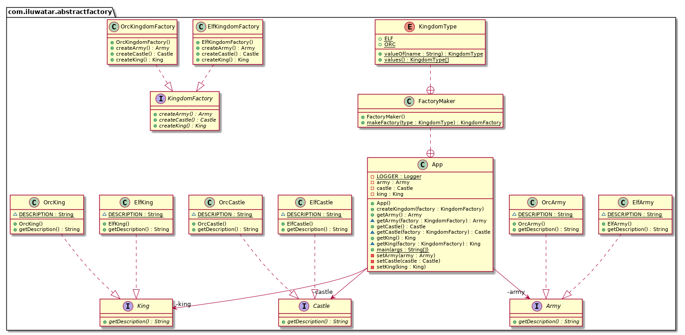

# Cours

## Fabrique abstraite (Abstract Factory)

La fabrique abstraite est un patron de conception qui permet de créer des familles d'objets liés entre eux sans avoir à spécifier leurs classes concrètes.

En d'autres termes : Une fabrique abstraite est une fabrique de fabrique

### Exemple

Pour créer un royaume, nous avons besoin d'objets avec un thème commun. Le royaume elfique a besoin d'un roi elfique, d'un château elfique et d'une armée elfique, tandis que le royaume orque a besoin d'un roi orque, d'un château orque et d'une armée orque. Il existe une dépendance entre les objets du royaume.

Nous pouvons créer une interface `King` et des classes `ElfKing`, `OrcKing` qui implémentent cette interface. De même, nous pouvons créer une interface `Castle` et des classes `ElfCastle`, `OrcCastle` qui implémentent cette interface. De même, nous pouvons créer une interface `Army` et des classes `ElfArmy`, `OrcArmy` qui implémentent cette interface.

```kotlin
interface King {
    fun getDescription(): String
}

class ElfKing : King {
    override fun getDescription(): String {
        return "This is the Elven king!"
    }
}

class OrcKing : King {
    override fun getDescription(): String {
        return "This is the Orc king!"
    }
}

interface Castle {
    fun getDescription(): String
}

class ElfCastle : Castle {
    override fun getDescription(): String {
        return "This is the Elven castle!"
    }
}

class OrcCastle : Castle {
    override fun getDescription(): String {
        return "This is the Orc castle!"
    }
}

interface Army {
    fun getDescription(): String
}

class ElfArmy : Army {
    override fun getDescription(): String {
        return "This is the Elven Army!"
    }
}

class OrcArmy : Army {
    override fun getDescription(): String {
        return "This is the Orc Army!"
    }
}
```

Nous pouvons créer une interface `KingdomFactory` et des classes `ElfKingdomFactory`, `OrcKingdomFactory` qui implémentent cette interface. Chaque classe de fabrique a une méthode pour créer chaque type d'objet du royaume.

```kotlin
interface KingdomFactory {
    fun createKing(): King
    fun createCastle(): Castle
    fun createArmy(): Army
}

class ElfKingdomFactory : KingdomFactory {
    override fun createKing(): King {
        return ElfKing()
    }

    override fun createCastle(): Castle {
        return ElfCastle()
    }

    override fun createArmy(): Army {
        return ElfArmy()
    }
}

class OrcKingdomFactory : KingdomFactory {
    override fun createKing(): King {
        return OrcKing()
    }

    override fun createCastle(): Castle {
        return OrcCastle()
    }

    override fun createArmy(): Army {
        return OrcArmy()
    }
}
```

Nous pouvons créer une enum `KingdomType` qui utilise spécifie le type de royaume.

```kotlin
enum class KingdomType {
    ELF, ORC
}
```

Nous pouvons créer une classe `KingdomFactoryMaker` qui utilise une fabrique pour créer les objets du royaume.

```kotlin
class KingdomFactoryMaker {
    companion object {
        fun makeFactory(type: KingdomType): KingdomFactory {
            return when (type) {
                KingdomType.ELF -> ElfKingdomFactory()
                KingdomType.ORC -> OrcKingdomFactory()
            }
        }
    }
}
```

Nous pouvons maintenant créer un `main` qui utilise la classe `KingdomFactoryMaker` pour créer des royaumes elfiques et orques.

```kotlin
fun main() {
    val elfKingdomFactory = KingdomFactoryMaker.makeFactory(KingdomType.ELF)
    val elfKing = elfKingdomFactory.createKing()
    val elfCastle = elfKingdomFactory.createCastle()
    val elfArmy = elfKingdomFactory.createArmy()
    println(elfKing.getDescription())
    println(elfCastle.getDescription())
    println(elfArmy.getDescription())

    val orcKingdomFactory = KingdomFactoryMaker.makeFactory(KingdomType.ORC)
    val orcKing = orcKingdomFactory.createKing()
    val orcCastle = orcKingdomFactory.createCastle()
    val orcArmy = orcKingdomFactory.createArmy()
    println(orcKing.getDescription())
    println(orcCastle.getDescription())
    println(orcArmy.getDescription())
}
```

Voici le diagramme de classe de cet exemple :



# Exercice

Implémentez une fabrique abstraite pour créer un environnement de jeu.

Nous allons utiliser un terrain, une faune et une flore. Chaque `Environment` aura ses propres classes de `Terrain`, de `Fauna` et de `Flora`.

Nous aurons besoin :

1. une fabrique de zone désertique qui créera des classes de terrain (sable), de faune (scorpions, chameaux) et de flore (cactus) pour le désert. 
2. une fabrique de zone de forêt qui créera des classes de terrain (humus), de faune (cerfs, sangliers) et de flore (bouleau, chêne) pour la forêt.
3. une fabrique de zone de montagne qui créera des classes de terrain (rochers), de faune (ours, loups) et de flore (sapin, pin) pour la montagne.
4. une fabrique de zone de plaine qui créera des classes de terrain (herbe), de faune (lapins, oiseaux) et de flore (rose, tulipe) pour la plaine.

Puis créez une fabrique abstraite qui permettra de sélectionner la bonne fabrique en fonction d'une énumération passée en paramètre.

Enfin, créez une classe `main` qui utilisera la fabrique abstraite pour créer des environnements de jeu.


